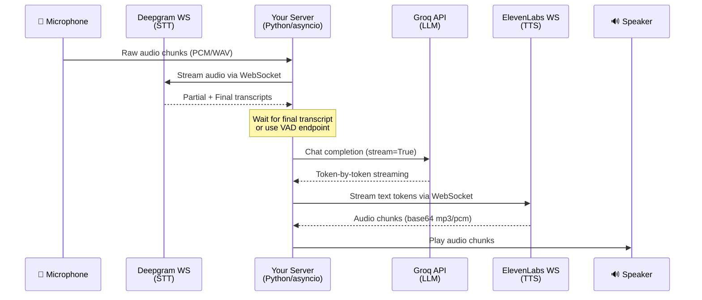

# 🎙️ Real-Time Voice AI Pipeline — Architecture & Implementation Plan

> **Deepgram (Ear) → Groq (Brain) → ElevenLabs (Voice)**
> A fully streaming, WebSocket-based voice-to-voice AI system.

---

## 1. High-Level Architecture



---

## 2. The Three APIs — Cheat Sheet

### 2.1 Deepgram — The Ear (Speech-to-Text)

| Detail | Value |
|---|---|
| **Protocol** | WebSocket |
| **Endpoint** | `wss://api.deepgram.com/v1/listen` |
| **Auth** | `Authorization: Token <DEEPGRAM_API_KEY>` header on WS handshake |
| **Input** | Raw audio bytes (PCM 16-bit, 16kHz mono recommended) |
| **Output** | JSON messages with `channel.alternatives[0].transcript` |
| **Key params** | `model=nova-3`, `smart_format=true`, `interim_results=true`, `endpointing=300`, `vad_events=true` |
| **SDK** | `pip install deepgram-sdk` |
| **Docs** | [Live Audio Streaming](https://developers.deepgram.com/reference/speech-to-text/listen-streaming) |

**Critical concepts:**
- **Interim results** (`is_final=false`): Partial transcripts that update as the user speaks — use for UI feedback
- **Final results** (`is_final=true`): Completed utterance — this is what you send to the LLM
- **Endpointing** (`endpointing=300`): Deepgram detects 300ms of silence and marks the utterance as final
- **VAD events**: Voice Activity Detection — know when the user starts/stops speaking

**Python SDK pattern:**
```python
from deepgram import DeepgramClient, LiveTranscriptionEvents, LiveOptions

deepgram = DeepgramClient(os.environ["DEEPGRAM_API_KEY"])
dg_connection = deepgram.listen.live.v("1")

async def on_transcript(self, result, **kwargs):
    transcript = result.channel.alternatives[0].transcript
    if result.is_final and transcript:
        # → Send to Groq LLM
        await process_with_llm(transcript)

dg_connection.on(LiveTranscriptionEvents.Transcript, on_transcript)

options = LiveOptions(
    model="nova-3",
    language="en",
    smart_format=True,
    interim_results=True,
    endpointing=300,
    vad_events=True,
    encoding="linear16",
    sample_rate=16000,
    channels=1,
)

await dg_connection.start(options)
# Then: await dg_connection.send(audio_bytes)
# Finally: await dg_connection.finish()
```

---

### 2.2 Groq — The Brain (LLM Inference)

| Detail | Value |
|---|---|
| **Protocol** | HTTPS (OpenAI-compatible REST) |
| **Endpoint** | `https://api.groq.com/openai/v1/chat/completions` |
| **Auth** | `Authorization: Bearer <GROQ_API_KEY>` |
| **Input** | Chat messages array (system + user messages) |
| **Output** | Streamed SSE chunks with `delta.content` |
| **Key params** | `model="llama-3.3-70b-versatile"`, `stream=True`, `temperature=0.7` |
| **SDK** | `pip install groq` (or `openai` with `base_url` override) |
| **Docs** | [Groq Overview](https://console.groq.com/docs/overview) • [groq-python](https://github.com/groq/groq-python) |

> [!TIP]
> Groq is **OpenAI API-compatible**. You can use the standard `openai` Python package by pointing `base_url` to `https://api.groq.com/openai/v1`. This means existing OpenAI code migrates with zero changes.

**Streaming pattern:**
```python
from groq import Groq

client = Groq(api_key=os.environ["GROQ_API_KEY"])

async def get_llm_response(user_text: str, conversation_history: list):
    """Stream LLM response token-by-token, yielding each chunk."""
    conversation_history.append({"role": "user", "content": user_text})

    stream = client.chat.completions.create(
        model="llama-3.3-70b-versatile",  # or "llama-3.1-8b-instant" for speed
        messages=[
            {"role": "system", "content": "You are a helpful voice assistant. Keep responses concise and conversational."},
            *conversation_history,
        ],
        stream=True,
        temperature=0.7,
        max_tokens=256,  # Keep short for voice
    )

    full_response = ""
    for chunk in stream:
        token = chunk.choices[0].delta.content
        if token:
            full_response += token
            yield token  # → Forward to ElevenLabs WS

    conversation_history.append({"role": "assistant", "content": full_response})
```

**Alternative with `openai` SDK:**
```python
from openai import OpenAI

client = OpenAI(
    api_key=os.environ["GROQ_API_KEY"],
    base_url="https://api.groq.com/openai/v1",
)
# Then use client.chat.completions.create() identically
```

---

### 2.3 ElevenLabs — The Voice (Text-to-Speech)

| Detail | Value |
|---|---|
| **Protocol** | WebSocket |
| **Endpoint** | `wss://api.elevenlabs.io/v1/text-to-speech/{voice_id}/stream-input?model_id={model_id}` |
| **Auth** | `xi_api_key` field in first JSON message |
| **Input** | JSON messages with `text` field (partial text chunks) |
| **Output** | JSON messages with `audio` field (base64-encoded audio) |
| **Key params** | `model_id=eleven_flash_v2_5` (lowest latency), `output_format=pcm_24000` |
| **SDK** | Raw `websockets` library (for max control) or `pip install elevenlabs` |
| **Docs** | [WebSocket Streaming](https://elevenlabs.io/docs/api-reference/text-to-speech/v-1-text-to-speech-voice-id-stream-input) |

> [!IMPORTANT]
> The WebSocket TTS API lets you **stream text in** as the LLM generates it, rather than waiting for the full response. This is the key to ultra-low latency.

**WebSocket protocol:**

```
1. Connect to WSS endpoint
2. Send: { "text": " ", "voice_settings": {...}, "xi_api_key": "..." }   ← Init
3. Send: { "text": "Hello, ", "try_trigger_generation": true }            ← Text chunk
4. Send: { "text": "how are you?", "try_trigger_generation": true }       ← Text chunk
5. Send: { "text": "" }                                                   ← End of input (flush)
6. Receive: { "audio": "<base64>", "isFinal": false }                     ← Audio chunks
7. Receive: { "audio": "<base64>", "isFinal": true }                      ← Last chunk
```

**Python pattern:**
```python
import websockets
import json
import base64

VOICE_ID = "21m00Tcm4TlvDq8ikWAM"  # Rachel (default)
MODEL_ID = "eleven_flash_v2_5"       # Lowest latency model

async def stream_tts(text_generator):
    """Stream text tokens from LLM into ElevenLabs and yield audio bytes."""
    uri = f"wss://api.elevenlabs.io/v1/text-to-speech/{VOICE_ID}/stream-input?model_id={MODEL_ID}&output_format=pcm_24000"

    async with websockets.connect(uri) as ws:
        # 1. Send initialization message
        await ws.send(json.dumps({
            "text": " ",
            "voice_settings": {"stability": 0.5, "similarity_boost": 0.75},
            "xi_api_key": os.environ["ELEVENLABS_API_KEY"],
        }))

        # 2. Task: Send text chunks as they arrive from LLM
        async def send_text():
            async for token in text_generator:
                await ws.send(json.dumps({
                    "text": token,
                    "try_trigger_generation": True,
                }))
            # 3. Signal end of input
            await ws.send(json.dumps({"text": ""}))

        # 4. Task: Receive audio chunks
        async def receive_audio():
            while True:
                response = json.loads(await ws.recv())
                if response.get("audio"):
                    audio_bytes = base64.b64decode(response["audio"])
                    yield audio_bytes  # → Play through speaker
                if response.get("isFinal"):
                    break

        # Run send and receive concurrently
        send_task = asyncio.create_task(send_text())
        async for audio_chunk in receive_audio():
            yield audio_chunk
        await send_task
```

---

## 3. The Glue — Connecting the Pipeline

### 3.1 Data Flow Overview

```
┌─────────────┐   audio bytes    ┌──────────────┐   transcript    ┌──────────┐
│ Microphone   │ ───────────────→ │  Deepgram WS  │ ──────────────→ │          │
│ (Browser/    │                  │  (STT)         │  (is_final)    │  Your    │
│  PyAudio)    │                  └──────────────┘                 │  Python  │
└─────────────┘                                                    │  Server  │
                                                                   │          │
┌─────────────┐   audio bytes    ┌──────────────┐   text tokens    │          │
│ Speaker      │ ←─────────────── │ ElevenLabs WS │ ←────────────── │          │
│ (Browser/    │   (base64→PCM)   │  (TTS)         │  (stream)      │          │
│  PyAudio)    │                  └──────────────┘                 └──────────┘
                                                                        │ ↑
                                                                        │ │
                                                      user transcript   │ │ token stream
                                                                        ↓ │
                                                                   ┌──────────┐
                                                                   │ Groq API  │
                                                                   │ (LLM)     │
                                                                   └──────────┘
```

### 3.2 Complete Pipeline Orchestrator

```python
import os
import asyncio
import json
import base64
import websockets
from deepgram import DeepgramClient, LiveTranscriptionEvents, LiveOptions
from groq import Groq

# ──────────────────────────────────────────
# Configuration
# ──────────────────────────────────────────
DEEPGRAM_API_KEY = os.environ["DEEPGRAM_API_KEY"]
GROQ_API_KEY = os.environ["GROQ_API_KEY"]
ELEVENLABS_API_KEY = os.environ["ELEVENLABS_API_KEY"]
ELEVENLABS_VOICE_ID = "21m00Tcm4TlvDq8ikWAM"  # Rachel
ELEVENLABS_MODEL_ID = "eleven_flash_v2_5"

groq_client = Groq(api_key=GROQ_API_KEY)
conversation_history = []


# ──────────────────────────────────────────
# Stage 2: Groq LLM (The Brain)
# ──────────────────────────────────────────
async def stream_llm_response(user_text: str):
    """Yield LLM response tokens one at a time."""
    conversation_history.append({"role": "user", "content": user_text})

    stream = groq_client.chat.completions.create(
        model="llama-3.3-70b-versatile",
        messages=[
            {
                "role": "system",
                "content": (
                    "You are a helpful voice assistant. Keep responses concise, "
                    "conversational, and under 3 sentences when possible."
                ),
            },
            *conversation_history,
        ],
        stream=True,
        temperature=0.7,
        max_tokens=256,
    )

    full_response = ""
    for chunk in stream:
        token = chunk.choices[0].delta.content
        if token:
            full_response += token
            yield token

    conversation_history.append({"role": "assistant", "content": full_response})


# ──────────────────────────────────────────
# Stage 3: ElevenLabs TTS (The Voice)
# ──────────────────────────────────────────
async def stream_tts(text_token_generator, audio_callback):
    """
    Stream text tokens into ElevenLabs WebSocket,
    receive audio chunks, and pass them to audio_callback.
    """
    uri = (
        f"wss://api.elevenlabs.io/v1/text-to-speech/"
        f"{ELEVENLABS_VOICE_ID}/stream-input"
        f"?model_id={ELEVENLABS_MODEL_ID}"
        f"&output_format=pcm_24000"
    )

    async with websockets.connect(uri) as ws:
        # Initialize connection
        await ws.send(json.dumps({
            "text": " ",
            "voice_settings": {"stability": 0.5, "similarity_boost": 0.75},
            "xi_api_key": ELEVENLABS_API_KEY,
        }))

        # Sender: forward LLM tokens to TTS
        async def send_tokens():
            async for token in text_token_generator:
                await ws.send(json.dumps({
                    "text": token,
                    "try_trigger_generation": True,
                }))
            # Signal end of text stream
            await ws.send(json.dumps({"text": ""}))

        # Receiver: collect audio chunks
        async def receive_audio():
            while True:
                try:
                    response = json.loads(await ws.recv())
                    if response.get("audio"):
                        audio_bytes = base64.b64decode(response["audio"])
                        await audio_callback(audio_bytes)
                    if response.get("isFinal"):
                        break
                except websockets.ConnectionClosed:
                    break

        # Run both concurrently
        await asyncio.gather(
            send_tokens(),
            receive_audio(),
        )


# ──────────────────────────────────────────
# Stage 1: Deepgram STT (The Ear)
# ──────────────────────────────────────────
async def start_pipeline(get_audio_stream, audio_callback):
    """
    Full pipeline: Mic → Deepgram → Groq → ElevenLabs → Speaker.

    Args:
        get_audio_stream: async generator yielding audio bytes from mic
        audio_callback: async function to play audio bytes
    """
    deepgram = DeepgramClient(DEEPGRAM_API_KEY)
    dg_connection = deepgram.listen.live.v("1")

    # When Deepgram produces a final transcript → trigger LLM + TTS
    async def on_transcript(self, result, **kwargs):
        transcript = result.channel.alternatives[0].transcript
        if not transcript:
            return

        if result.is_final:
            print(f"\n🎤 User: {transcript}")

            # Pipeline: transcript → LLM stream → TTS stream → speaker
            token_gen = stream_llm_response(transcript)
            await stream_tts(token_gen, audio_callback)
        else:
            # Interim result — show for UI feedback
            print(f"  ... {transcript}", end="\r")

    dg_connection.on(LiveTranscriptionEvents.Transcript, on_transcript)

    options = LiveOptions(
        model="nova-3",
        language="en",
        smart_format=True,
        interim_results=True,
        endpointing=300,
        vad_events=True,
        encoding="linear16",
        sample_rate=16000,
        channels=1,
    )

    await dg_connection.start(options)

    # Stream audio from microphone to Deepgram
    async for audio_chunk in get_audio_stream():
        await dg_connection.send(audio_chunk)

    await dg_connection.finish()
```

---

## 4. Implementation Options

### Option A: CLI App (Python Only — Fastest to Build)

Use `pyaudio` for microphone capture and playback.

```python
import pyaudio

RATE = 16000
CHUNK = 4096
FORMAT = pyaudio.paInt16
CHANNELS = 1

p = pyaudio.PyAudio()

# Microphone stream
mic_stream = p.open(format=FORMAT, channels=CHANNELS, rate=RATE,
                     input=True, frames_per_buffer=CHUNK)

# Speaker stream
speaker_stream = p.open(format=pyaudio.paInt16, channels=1,
                         rate=24000, output=True, frames_per_buffer=CHUNK)

async def get_audio_stream():
    """Yield audio chunks from the microphone."""
    while True:
        data = mic_stream.read(CHUNK, exception_on_overflow=False)
        yield data
        await asyncio.sleep(0)  # Yield control to event loop

async def play_audio(audio_bytes):
    """Play audio bytes through the speaker."""
    speaker_stream.write(audio_bytes)

# Run the pipeline
asyncio.run(start_pipeline(get_audio_stream, play_audio))
```

### Option B: Web App (Browser + FastAPI Backend)

The browser captures audio via `getUserMedia()`, sends it over a WebSocket to your FastAPI server, which runs the pipeline and sends audio back.

```
Browser                          FastAPI Server
──────                          ──────────────
getUserMedia() ──→ WS ──→  Deepgram WS  ──→  Groq API  ──→  ElevenLabs WS
                   ↑                                               │
                   └──────────────── WS audio chunks ←─────────────┘
```

**Key files for Option B:**
- `server.py` — FastAPI + WebSocket endpoint
- `index.html` — Browser mic capture + audio playback
- `requirements.txt` — Python dependencies

---

## 5. Project Structure

```
voice-pipeline/
├── .env                    # API keys (never commit!)
├── requirements.txt        # Python dependencies
├── server.py               # FastAPI WebSocket server (Option B)
├── cli.py                  # Terminal-based pipeline (Option A)
├── pipeline/
│   ├── __init__.py
│   ├── stt.py              # Deepgram STT module
│   ├── llm.py              # Groq LLM module
│   └── tts.py              # ElevenLabs TTS module
├── static/
│   └── index.html          # Browser client (Option B)
└── README.md
```

---

## 6. Environment Variables

```bash
# .env file
DEEPGRAM_API_KEY=your_deepgram_key_here
GROQ_API_KEY=your_groq_key_here
ELEVENLABS_API_KEY=your_elevenlabs_key_here
```

---

## 7. Dependencies

```
# requirements.txt
deepgram-sdk>=3.0.0
groq>=0.9.0
websockets>=12.0
python-dotenv>=1.0.0
fastapi>=0.110.0          # For web app (Option B)
uvicorn>=0.27.0           # For web app (Option B)
pyaudio>=0.2.14           # For CLI app (Option A)
```

---

## 8. Latency Optimization Checklist

| Optimization | Impact | How |
|---|---|---|
| **Deepgram `endpointing=300`** | ⚡⚡⚡ | Detect end-of-speech faster (300ms silence threshold) |
| **Groq `llama-3.1-8b-instant`** | ⚡⚡⚡ | Fastest model; use for speed-critical scenarios |
| **ElevenLabs `eleven_flash_v2_5`** | ⚡⚡⚡ | Lowest-latency TTS model |
| **ElevenLabs `pcm_24000` output** | ⚡⚡ | PCM is uncompressed — no decode overhead |
| **Stream text to TTS token-by-token** | ⚡⚡⚡ | Don't wait for full LLM response — pipe tokens directly |
| **`try_trigger_generation: true`** | ⚡⚡ | ElevenLabs starts generating audio before all text arrives |
| **Short system prompt** | ⚡ | Fewer tokens = faster time-to-first-token from Groq |
| **`max_tokens=256`** | ⚡ | Cap response length for voice (nobody wants a monologue) |
| **Use `asyncio.gather()`** | ⚡⚡ | Run TTS send + receive concurrently |

---

## 9. Interrupt Handling (Barge-In)

> [!WARNING]
> If the user starts speaking while the AI is still talking, you need **barge-in** support.

**Strategy:**
1. Monitor Deepgram's VAD events while TTS audio is playing
2. When `speech_started` event fires during playback:
   - Stop playing the current TTS audio
   - Close / flush the ElevenLabs WebSocket
   - Cancel the ongoing Groq stream
   - Start listening for the new utterance

```python
# Pseudocode for barge-in
is_speaking = False
current_tts_task = None

async def on_speech_started(self, speech_started, **kwargs):
    global is_speaking, current_tts_task
    if is_speaking and current_tts_task:
        current_tts_task.cancel()
        is_speaking = False
        print("⚡ Barge-in detected — stopping AI speech")
```

---

## 10. Error Handling & Resilience

```python
# Wrap each stage with retry logic
import asyncio
from contextlib import asynccontextmanager

MAX_RETRIES = 3

async def with_retry(coro_func, *args, retries=MAX_RETRIES):
    """Retry an async function with exponential backoff."""
    for attempt in range(retries):
        try:
            return await coro_func(*args)
        except (websockets.ConnectionClosed, ConnectionError) as e:
            wait = 2 ** attempt
            print(f"⚠️  Connection error: {e}. Retrying in {wait}s...")
            await asyncio.sleep(wait)
    raise RuntimeError(f"Failed after {retries} retries")
```

---

## 11. Weekend Build Plan

### Day 1 (Saturday) — Get Each Piece Working

| Time | Task | Done? |
|---|---|---|
| 1h | Set up project, `.env`, install deps | ☐ |
| 1h | `stt.py` — Stream mic audio to Deepgram, print transcripts | ☐ |
| 1h | `llm.py` — Send text to Groq, stream response to console | ☐ |
| 1h | `tts.py` — Send text to ElevenLabs WS, save audio to file | ☐ |
| 1h | Wire the three together in `cli.py` — end-to-end voice | ☐ |

### Day 2 (Sunday) — Web UI + Polish

| Time | Task | Done? |
|---|---|---|
| 2h | `server.py` — FastAPI WebSocket bridge | ☐ |
| 2h | `index.html` — Browser mic capture + AudioWorklet playback | ☐ |
| 1h | Add conversation history & context | ☐ |
| 1h | Add barge-in support | ☐ |
| 1h | Error handling, logging, README | ☐ |

---

## 12. Quick Reference — API Keys

| Service | Get API Key | Free Tier |
|---|---|---|
| **Deepgram** | [console.deepgram.com](https://console.deepgram.com) | $200 free credit |
| **Groq** | [console.groq.com/keys](https://console.groq.com/keys) | Generous free tier |
| **ElevenLabs** | [elevenlabs.io](https://elevenlabs.io) | 10k chars/month free |

---

> [!NOTE]
> This document covers the **architecture, API contracts, code patterns, optimization strategies, and a step-by-step weekend build plan**. Each code block is a working pattern that can be directly used in your implementation. The pipeline is designed for **maximum streaming efficiency** — text flows from LLM to TTS token-by-token, and audio starts playing before the full response is generated.
